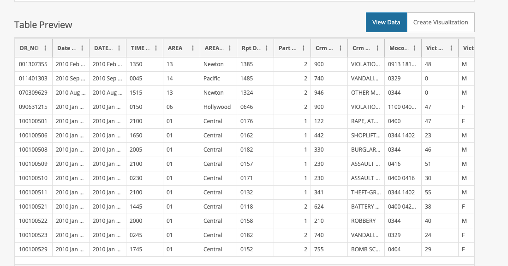
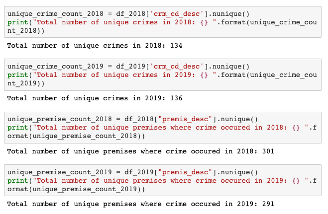
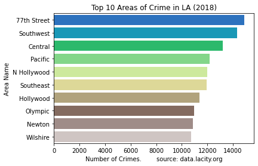
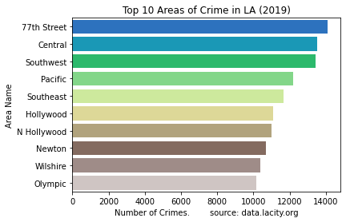
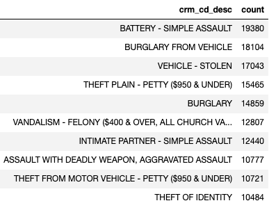
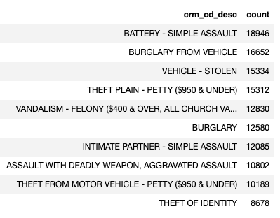
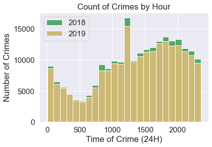
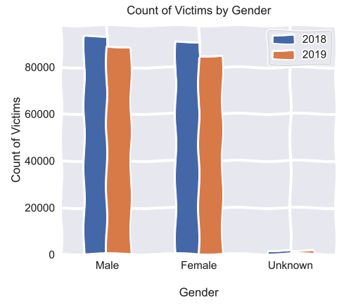

# City of Lost Angels: Analyzing Crime in Metropolitan Los Angeles

## Overview

This project will explore the different areas of metropolitan Los Angeles in relation to crime statistics provided by the Open Data City of LA website. There may be some promising insights as to location, victim profile, crime type, and time/date in relation to crime incidents.

## Dataset Information

Original Dataset: Crime Data from 2010 to 2019

This dataset reflects incidents of crime in the City of Los Angeles from 2010 - 2019. This data is transcribed from original crime reports that are typed on paper and therefore there may be some inaccuracies within the data. Some location fields with missing data are noted as (0°, 0°). Address fields are only provided to the nearest hundred block in order to maintain privacy. This data is as accurate as the data in the database. Please note questions or concerns in the comments.

The focus is on two years of crime incident data in LA: 2018 and 2019

- Dataset Source: https://data.lacity.org/A-Safe-City/Crime-Data-from-2010-to-2019/63jg-8b9z

Data Last Updated: July 15, 2020

Data Provided By: Los Angeles Police Department

## Attachments

- Summary Reporting System (SRS)
  User Manual by the Criminal Justice Information Services (CJIS) Division Uniform Crime Reporting (UCR) Program:
  https://data.lacity.org/api/views/63jg-8b9z/files/131cdc45-bfbc-433f-b370-deeb3efeb5ff?download=true&filename=ucr_handbook_2013.pdf

- MO Codes (Modus Operandi criminal codes):
  https://data.lacity.org/api/views/63jg-8b9z/files/3db69cd3-446c-4dcd-82eb-3436dc08d3be?download=true&filename=MO_CODES_Numerical_20180627.pdf

## Questions of Exploration

- What are some descriptive statistics of victim profile of crime incidents? (age, gender, ethnicity)

- What day of week and time do most crimes occur?

- What areas and zip codes have the highest number of crime incidents?

- How has the rate of crime changed from the years2018 to 2019.

- Are certain premises or location surroundings more prone to certain types of crime?

- What insights can be inferred from geolocation data such as GPS coordinates of certain patterns of crime?

## Data Exploration

The raw dataset contains 2.11 million entries and 28 columns for all years from 2010 2019.

Utilizing the Web API from the City of LA Open Data website, this projects uses a SQL query to filter and focus on crime incidents occuring in the years 2018 and 2019.

Year 2018: 228,363 rows and 28 columns  
Year 2019: 216,412 rows and 28 columns

## Exploratory Data Analysis

### Comparing Crime in 2018 and 2019

#### Overall Crime Statistics

- There were 228,363 reported crime incidents that occured within the 2018 calendar year.
- There were 216,412 reported crime incidents that occured within the 2019 calendar year.
- This was a decrease of 11,951 crime incidents, a decrease of 5.23%.

### Unique Crime Types and Premises

### Top 10 Areas of Crime

- The top 10 areas of crime have not changed for both years of 2018 and 2019.
- The area of "77th Street" has been the location of the highest number of crime incidents in both 2018 and 2019.

 

## Top 10 Crime Types

- From the data, the highest occuring crime type for 2018 and 2019 was BATTERY - SIMPLE ASSAULT.
- Also, the top 10 crime types for both 2018 and 2019 remained the same.

 

## Distribution of Crimes by Hour

- In 2018, the average time of a crime is **1:55PM**.  
  The median time of a crime is **2:30PM**.   The mode time of a crime is **12:00PM**.

- In 2019, the average time of a crime is **1:54PM**.  
  The median time of a crime is **2:30PM**.  
  The mode time of a crime is **12:00PM**.

## Victim Information

- The dataset for 2018 has been filtered from 228,363 to 185,563 observations.
- The dataset for 2019 has been filtered from 216,412 to 174,715 observations.
- Data cleaning was applied by removing any null values and limiting victim ages of 1-98 years old.

### By Gender

