# City of Lost Angels: Analyzing Crime in Metropolitan Los Angeles

## Overview

This project will explore the different areas of metropolitan Los Angeles in relation to crime statistics provided by the Open Data City of LA website. There may be some promising insights as to location, victim profile, crime type, and time/date in relation to crime incidents.

## Contents

1. [Dataset](#Dataset)
2. [Questions](#Questions)
3. [Exploration](#Exploration)
4. [Analysis](#Analysis)
5. [Geography](#Geography)
6. [Summary](#Summary)
7. [Discussion](#Discussion)

# Dataset

Original Dataset: Crime Data from 2010 to 2019

This dataset reflects incidents of crime in the City of Los Angeles from 2010 - 2019. This data is transcribed from original crime reports that are typed on paper and therefore there may be some inaccuracies within the data. Some location fields with missing data are noted as (0°, 0°). Address fields are only provided to the nearest hundred block in order to maintain privacy. This data is as accurate as the data in the database. Please note questions or concerns in the comments. The focus is on two years of crime incident data in LA: 2018 and 2019

- Dataset Source: https://data.lacity.org/A-Safe-City/Crime-Data-from-2010-to-2019/63jg-8b9z

Data Last Updated: July 15, 2020

Data Provided By: Los Angeles Police Department

## Attachments

- Summary Reporting System (SRS)
  User Manual by the Criminal Justice Information Services (CJIS) Division Uniform Crime Reporting (UCR) Program:
  https://data.lacity.org/api/views/63jg-8b9z/files/131cdc45-bfbc-433f-b370-deeb3efeb5ff?download=true&filename=ucr_handbook_2013.pdf

- MO Codes (Modus Operandi criminal codes):
  https://data.lacity.org/api/views/63jg-8b9z/files/3db69cd3-446c-4dcd-82eb-3436dc08d3be?download=true&filename=MO_CODES_Numerical_20180627.pdf

# Questions

- What are some descriptive statistics of victim profile of crime incidents? (age, gender, ethnicity)

- What day of week and time do most crimes occur?

- What areas and zip codes have the highest number of crime incidents?

- How has the rate of crime changed from the years 2018 to 2019?

- Are certain premises or location surroundings more prone to certain types of crime?

- What insights can be inferred from geolocation data such as GPS coordinates of certain patterns of crime?

# Exploration

The raw dataset contains 2.11 million entries and 28 columns for all years from 2010 to 2019.

Utilizing the Web API from the City of LA Open Data website, this projects uses a SQL query to filter and focus on crime incidents occuring in the years 2018 and 2019.

- **Year 2018:** 228,363 rows and 28 columns  
- **Year 2019:** 216,412 rows and 28 columns

## Exploratory Data Analysis

### Comparing Crime in 2018 and 2019

#### Overall Crime Statistics

- There were **228,363** reported crime incidents that occured within the **2018** calendar year.
- There were **216,412** reported crime incidents that occured within the **2019** calendar year.
- This was a decrease of **11,951** crime incidents, a decrease of _5.23%_.

### Unique Crime Types and Premises

### Top 10 Areas of Crime

- The top 10 areas of crime have not changed for both years of 2018 and 2019.
- The area of "77th Street" has been the location of the highest number of crime incidents in both 2018 and 2019.

s

### Top 10 Crime Types

- From the data, the highest occuring crime type for 2018 and 2019 was **BATTERY - SIMPLE ASSAULT.**
- Also, the top 10 crime types for both 2018 and 2019 remained the same.

# Analysis

## Distribution of Crimes by Hour

### Summary Statistics

| Year | Average Time | Median Time | Mode Time |
| ---- | ------------ | ----------- | --------- |
| 2018 | 1:55PM       | 2:30PM      | 12:00PM   |
| 2019 | 1:54PM       | 2:30PM      | 12:00PM   |

## Hypothesis Testing

Null Hypothesis: H0

> The average time of a crime incident has **NOT** changed between the years 2018 and 2019 in Los Angeles.

Alternative Hypothesis: HA

> The avaerage time of a crime incident **HAS** changed between the years 2018 and 2019 in Los Angeles.

Significance Level (alpha) = 0.05

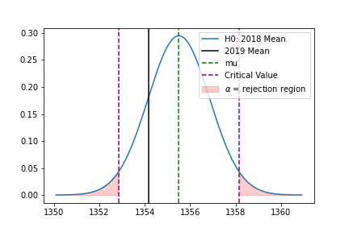

< -- # // TODO: Hypothesis Testing -- statistical signicance of higher crime incident on New Years Day 2018?? -- >

## Date, Time, and Day of Week

### "Noon"-Time Madness

- The most common time of day of a crime incidence occured at **12PM noon** time, regardless of the day week.
- The day of week and time of day that a crime incident occured was **Monday at 12PM noon** time.
- The fact that there is a high reported occurence at 12PM noon time may suggest some sort of bias or error in reporting.
  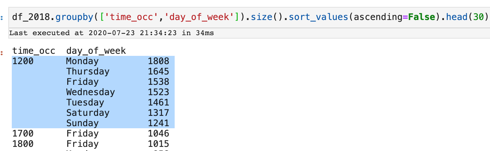

### New Month, New You

- The most common date of a crime incident was on **New Year's Day**.
- Interestingly, the top 12 dates where crime occured ALL were on the **FIRST** of the month.
- The fact that there is a high reported occurence on the FIRST of the month may also suggest some sort of bias or error in reporting.
  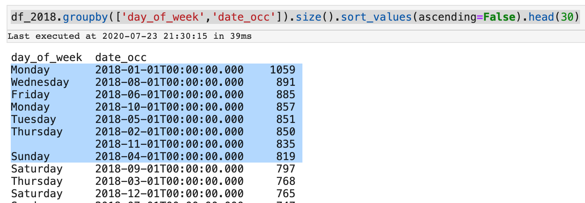

### Holidays are "Holy" Days

- The least common date of a crime incident was on Christmas Day (December 25).
- Also, note Veteran's Day, a public holiday on November 12 with the 3rd least number of crime incidents that year.
- February can be considered a month of "love" with such holidays as Valentine's Day, Presidents Day, and Ash Wednesday.
- The religious overtones of the holidays may have a "Halo effect" or "Honeymoon effect" influencing human behavior to be more "good" during the month of February.
   
  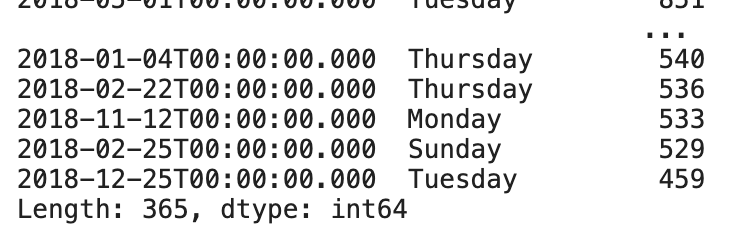

## Victim Information

- The dataset for 2018 has been filtered from 228,363 to **185,563** observations.
- The dataset for 2019 has been filtered from 216,412 to **174,715** observations.
- Data cleaning was applied by removing any null values and limiting victim ages of 1-98 years old.

### By Gender

### By Age

- The average age of a crime victim in **2018** was **39.36** years old with a standard deviation of **15.96**
- The average age of a crime victim in **2019** was **39.28** years old with a standard deviation of **15.89**

# Geography

## Concentrated Hotspots of Crime

- The larger circles indicated more concentrated hotspots of crime incidents.
- The largest circles are colored black refers to counts of 400 or more crime incidents.
- Notice the 3 large black circles on the map indicating highest concentration of crime incidents.
  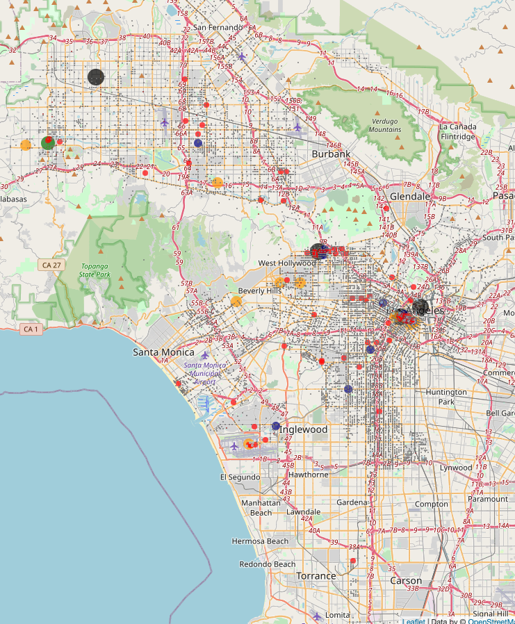

## By Zip Code

- The GPS coordinates of latitude and longitude are converted to corresponding Zip Codes using a helper function.
- A cholorpleth map is used to indicate the Zip Code boundaries and prevalence of crimes.

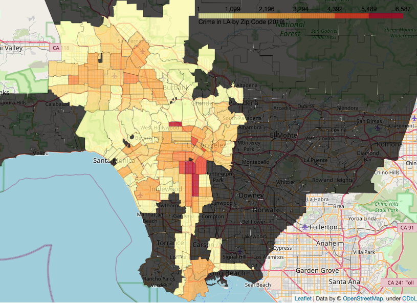

## By Police District

- The LAPD divides their jurisdiction into 21 Police Districts
  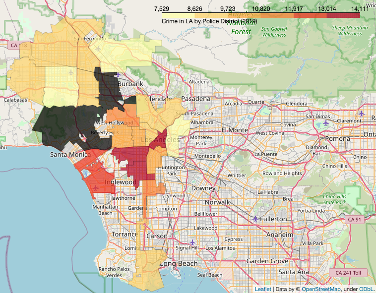

## By Heatmap

- THe heatmap indicates clusters of total crime incidents from map-level to street-level in accuracy.
- The individual pins indicate specific crime occurences mapped by GPS coordinates.

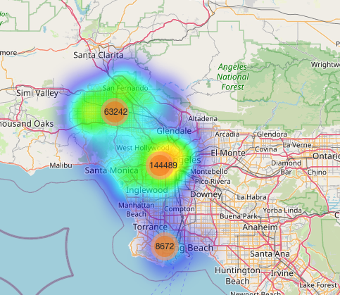
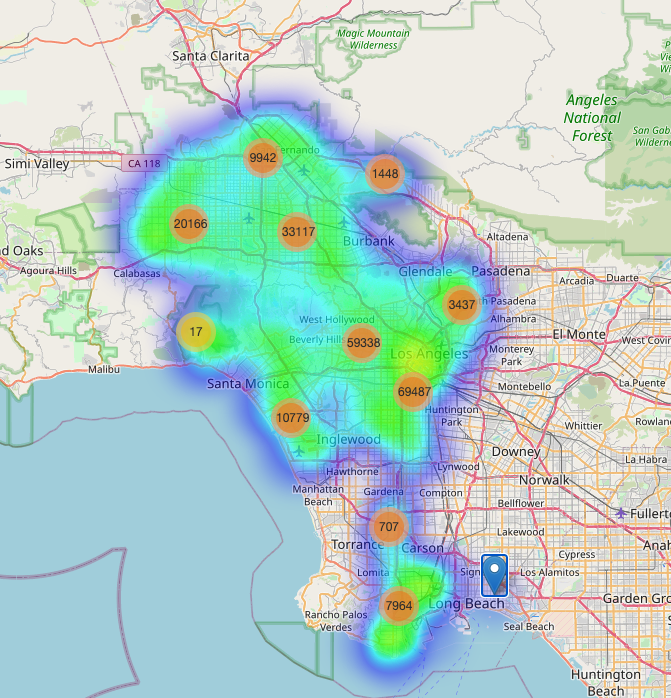
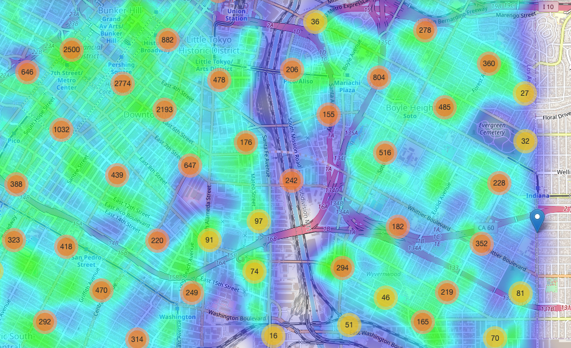

- At a street-level, there seems to be some higher levels of crime activity near the Los Angeles River or along major freeways.
  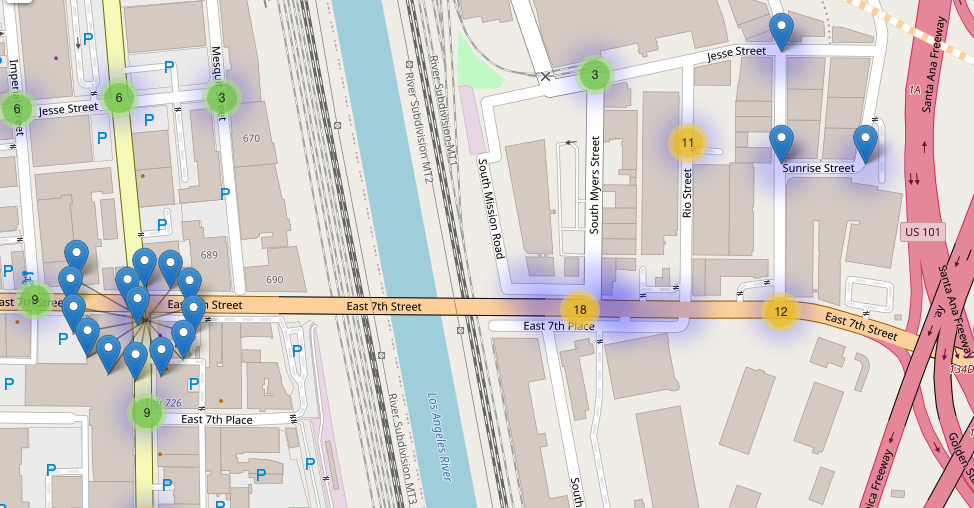

# Summary

## The "Hangry" Hypothesis

- In both 2018 and 2019, the most frequent time of a crime occured at **12:00PM** noon time.
- The average time of a crime in 2018 and 2019 was both around **1:54-1:55PM**.
- In both 2018 and 2019, **Friday** was the day of the week with the highest count of crimes. Saturdays and Mondays were also days of observed crime incidents.
- The average age of a victim for both years was **39.3 years old**.
- The most common crime was **BATTERY - SIMPLE ASSAULT**, then followed by BURGLARY FROM VEHICLE, VEHICLE - STOLEN, and THEFT PLAIN - PETTY (\$950 & UNDER).
- The "hotbed" locations of crime tended to be concentrated in urban districts or tourist areas of Downtown Los Angeles, Hollywood, and Santa Monica.
- "hangry" = "hungry" + "angry"

## Main Takeaways

- Don't mess with people who haven't had their lunch yet, especially around 12-2PM!
- Avoid tourist traps or other heavily populated urban areas of the city!
- Be careful on the first of every new month, especially New Year's Day!

# Discussion

- How does crime compare in your city?
- What are the social, economic, or political implications of crime?
- How can we use this data to make better public policy decisions? (e.g., infrastructure, city planning, education)dd
- How can businesses utilize this data in serving the community with their products and services to the right customer base? (e.g., restaurants, ridesharing, tourism)
- Are there other factors to consider as a threshold of moving to or away from another city?

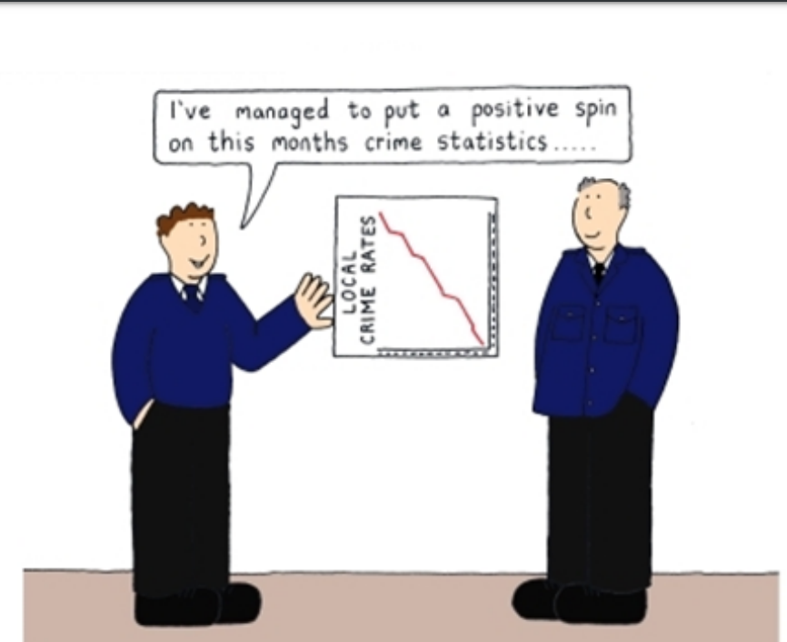

## Improvements to Consider

- Convert military time (24hr) to AM/PM time for x-axis on matplotlib histogram
- Track crime by date for seasonal, monthly, or weekly patterns
- More hypothesis testing such as Chi-Square and Mann Whitney U-Test
- Compare crime data with traffic data
- Look deeper into victim information like victim ethnicity, age, and gender in relation to certain types of crimes
- Haversine formula and ocean reference point
- Correlation heatmap
- Scatterplot of GPS coordinates
- Time series analysis of crimes in a 24-hour period

## Food for Thought:

- Is violence contagious?
  - "According to social learning theory, people learn aggressive and violent behaviors the same way they learn other social behaviors: by direct experience and by observing others and imitating their behavior."
    - https://www.ncbi.nlm.nih.gov/pmc/articles/PMC5227928/
  - "Violence begets violence."
    - https://en.wikipedia.org/wiki/Violence_begets_violence
  - "Man's inhumanity to man"
    - https://en.wikipedia.org/wiki/Man's_inhumanity_to_man
